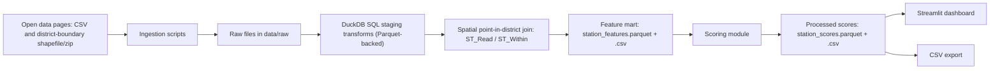
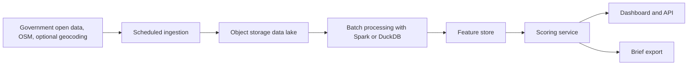

# Architecture

## Current Architecture

DuckDB plus its `spatial` extension is the only processing engine, and Parquet is the
on-disk feature/score format; CSV is exported alongside Parquet for downstream
compatibility. Walking-radius competition modeling, New Taipei City coverage, and a
persistent database store (versus ad hoc DuckDB connections per script run) remain
future work.

## Production-Scale Architecture

## Data Flow

1. Download public datasets, including the Taipei district boundary shapefile/zip and the land-value CSV, into `data/raw`.
2. Stage and normalize every source as SQL tables inside DuckDB (`retail_scout/pipeline.py`).
3. Resolve each MRT station to a Taipei City district with a spatial point-in-district join (`ST_Within` against entrance coordinates and district polygons); stations whose entrances fall outside Taipei City district polygons are dropped, and the dropped count is logged.
4. Build the station-level feature mart for all resolved Taipei City stations and export it as both Parquet and CSV.
5. Score each station with a risk-adjusted economic opportunity model and export the result as both Parquet and CSV.
6. Serve the ranked result through Streamlit, which reads `station_scores.csv`.

## Current Boundary

The current version uses station trade areas instead of exact store parcels, and competition is counted at district level rather than an exact walking radius. This keeps the system practical while still demonstrating data monetization: the customer pays for faster first-pass site screening before spending money on lease visits or consultants.
