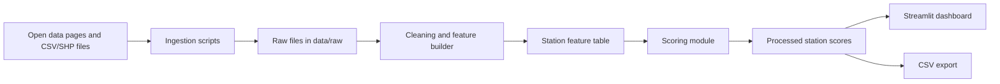
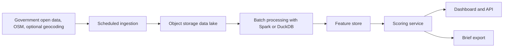

# Architecture

## Current Architecture

## Production-Scale Architecture

## Data Flow

1. Download public datasets into `data/raw`.
2. Normalize field names and filter the initial scope to Taipei MRT-adjacent retail trade areas.
3. Aggregate every source to a station-level feature table.
4. Score each station with a transparent weighted formula.
5. Serve the ranked result through Streamlit and export the table for downstream analysis.

## Current Boundary

The current version uses station trade areas instead of exact store parcels. This keeps the system practical while still demonstrating data monetization: the customer pays for faster first-pass site screening before spending money on lease visits or consultants.
